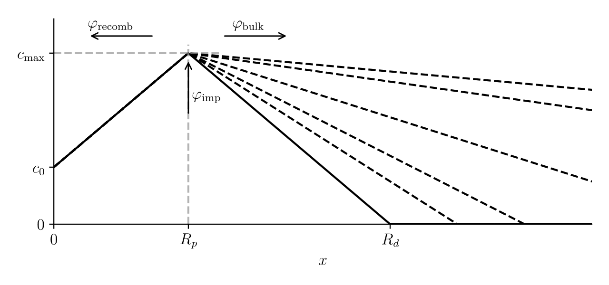

.. _theory:

======
Theory
======

--------------
Bulk physics 
--------------

H transport
^^^^^^^^^^^
The model developed by McNabb & Foster :cite:`McNabb1963` is used to model hydrogen transport in materials in FESTIM. The principle is to separate mobile hydrogen :math:`c_\mathrm{m}` and trapped hydrogen :math:`c_\mathrm{t}`. The diffusion of mobile particles is governed by Fick’s law of diffusion where the hydrogen flux is

.. math::
    :label: eq_difflux
    
    J = -D \nabla c_\mathrm{m}

where :math:`D=D(T)` is the diffusivity. Each trap :math:`i` is associated with a trapping and a detrapping rate :math:`k_i` and :math:`p_i`, respectively, as well as a trap density :math:`n_i`.

The temporal evolution of :math:`c_\mathrm{m}` and :math:`c_{\mathrm{t}, i}` are then given by:

.. math::
    :label: eq_mobile_conc

    \frac {\partial c_\mathrm{m}} { \partial t} = \nabla \cdot (D\nabla c_\mathrm{m}) - \sum_i \frac{\partial c_{\mathrm{t},i}} { \partial t} + \sum_j S_j

.. math::
    :label: eq_trapped_conc

    \frac {\partial c_{\mathrm{t}, i}} { \partial t} = k_i c_\mathrm{m} (n_i - c_{\mathrm{t},i}) - p_i c_{\mathrm{t},i}

where :math:`S_j=S_j(x,y,z,t)` is a source :math:`j` of mobile hydrogen. In FESTIM, source terms can be space and time dependent. These are used to simulate plasma implantation in materials, tritium generation from neutron interactions, etc. 
These equations can be solved in cartesian coordinates but also in cylindrical and spherical coordinates. This is useful, for instance, when simulating hydrogen transport in a pipe or in a pebble. FESTIM can solve steady-state hydrogen transport problems.

Soret effect
^^^^^^^^^^^^
FESTIM can include the Soret effect :cite:`Pendergrass1976,Longhurst1985` (also called thermophoresis, temperature-assisted diffusion, or even thermodiffusion) to hydrogen transport. The flux of hydrogen :math:`J` is then written as:

.. math::
    :label: eq_Soret

    J = -D \nabla c_\mathrm{m} - D\frac{Q^* c_\mathrm{m}}{R_g T^2} \nabla T

where :math:`Q^*` is the Soret coefficient (also called heat of transport) and :math:`R_g` is the gas constant.

Conservation of chemical potential at interfaces
^^^^^^^^^^^^^^^^^^^^^^^^^^^^^^^^^^^^^^^^^^^^^^^^
Continuity of local partial pressure :math:`P` at interfaces between materials has to be ensured. In the case of a material behaving according to Sievert’s law of solubility (metals), the partial pressure is expressed as:

.. math::
    :label: eq_Sievert   

    P = \frac{c_\mathrm{m}^2}{K_S^2}

where :math:`K_S` is the material solubility (or Sivert's constant).

In the case of a material behaving according to Henry's law of solubility, the partial pressure is expressed as:

.. math::
    :label: eq_Henry 

    P = \frac{c_\mathrm{m}}{K_H}

where :math:`K_H` is the material solubility (or Henry's constant).

Two different interface cases can then occur. At the interface between two Sievert or two Henry materials, the continuity of partial pressure yields:

.. math::
    :label: eq_continuity  

    \begin{eqnarray} 
    \frac{c_\mathrm{m}^-}{K_S^-}&=&\frac{c_\mathrm{m}^+}{K_S^+} \\
    &\mathrm{or}& \\
    \frac{c_\mathrm{m}^-}{K_H^-}&=&\frac{c_\mathrm{m}^+}{K_H^+}
    \end{eqnarray}

where exponents :math:`+` and :math:`-` denote both sides of the interface.

At the interface between a Sievert and a Henry material:

.. math::
    :label: eq_continuity_HS  

    \left(\frac{c_\mathrm{m}^-}{K_S^-}\right)^2 = \frac{c_\mathrm{m}^+}{K_H^+}

It appears from these equilibrium equations that a difference in solubilities introduces a concentration jump at interfaces.

In FESTIM, the conservation of chemical potential is obtained by a change of variables :cite:`Delaporte-Mathurin2021`. The variable :math:`\theta` is introduced and:

.. math::
    :label: eq_theta

    \theta = 
    \begin{cases}
    \frac{c_\mathrm{m}^2}{K_S^2} & \text{in Sievert materials} \\
    \frac{c_\mathrm{m}}{K_H}     & \text{in Henry materials}
    \end{cases}

The variable :math:`\theta` is continuous at interfaces.

Equations :eq:`eq_mobile_conc` and :eq:`eq_trapped_conc` are then rewritten and solved for :math:`\theta`. Note, the boundary conditions are also rewritten. Once solved, the discontinuous :math:`c_\mathrm{m}` field is obtained from :math:`\theta` and the solubilities by solving Equation :eq:`eq_theta` for :math:`c_\mathrm{m}`.

Arrhenius law
^^^^^^^^^^^^^^
Many processes involved in hydrogen transport (e.g., diffusion, trapping/detrapping, desorption, etc.) are thermally activated. The coefficients characterising these processes (e.g., diffusivity, trapping/detrapping rates, recombination coefficients, etc.) are usually assumed to be temperature dependent and follow the Arrhenius law. 
According to the latter, the rate :math:`k(T)` of a thermally activated process can be expressed as: 

.. math::
    :label: eq_arrhenius_law

    k(T) = k_0 \exp \left[-\frac{E_k}{k_B T} \right]

where :math:`k_0` is the pre-exponential factor, :math:`E_k` is the process activation energy, :math:`k_B` is the Boltzmann constant, and :math:`T` is the temperature. 

Heat transfer
^^^^^^^^^^^^^^
To properly account for the temperature-dependent parameters, an accurate representation of the temperature field is often required. FESTIM can solve a heat transfer problem governed by the heat equation:

.. math::
    :label: eq_heat_transfer

    \rho C_p \frac{\partial T}{\partial t} = \nabla \cdot (\lambda \nabla T) + \sum_i Q_i

where :math:`T` is the temperature, :math:`C_p` is the specific heat capacity, :math:`\rho` is the material's density, :math:`\lambda` is the thermal conductivity and :math:`Q_i` is a volumetric heat source :math:`i`. As for the hydrogen transport problem, the heat equation can be solved in steady state. In FESTIM, the thermal properties of materials can be arbitrary functions of temperature.

---------------
Surface physics 
---------------
To fully pose the hydrogen transport problem and optionally the heat transfer  problem, boundary conditions are required. Boundary conditions are separated in three categories: 1) enforcing the value of the solution at a boundary (Dirichlet’s condition) 2) enforcing the value of gradient of the solution (Neumann’s condition) 3) enforcing the value of the gradient as a function of the solution itself (Robin’s condition).

Dirichlet BC
^^^^^^^^^^^^^

In FESTIM, users can fix the mobile hydrogen concentration :math:`c_\mathrm{m}` and the temperature :math:`T` at boundaries :math:`\delta \Omega` (Dirichlet):

.. math::
    :label: eq_DirichletBC_c
    
    c_\mathrm{m} = f(x,y,z,t)~\text{on}~\delta\Omega

.. math::
    :label: eq_DirichletBC_T
    
    T = f(x,y,z,t)~\text{on}~\delta\Omega

where :math:`f` is an arbitrary function of coordinates :math:`x,y,z` and time :math:`t`.

FESTIM has built-in Dirichlet’s boundary conditions for Sievert’s condition, Henry’s condition (see Equations :eq:`eq_DirichletBC_Sievert` and :eq:`eq_DirichletBC_Henry`, respectively).

.. math::
    :label: eq_DirichletBC_Sievert
    
    c_\mathrm{m} = K_S \sqrt{P}~\text{on}~\delta\Omega

.. math::
    :label: eq_DirichletBC_Henry
    
    c_\mathrm{m} = K_H P~\text{on}~\delta\Omega

Plasma implantation approximation
^^^^^^^^^^^^^^^^^^^^^^^^^^^^^^^^^^

Dirichlet’s boundary conditions can also be used to approximate plasma implantation in near surface regions to be more computationally efficient :cite:`Delaporte-Mathurin2022`. 
Let us consider a volumetric source term of hydrogen :math:`\Gamma=\varphi_{\mathrm{imp}}f(x)`, where :math:`f(x)` is a narrow Gaussian distribution. The concentration profile of mobile species can be approximated by a triangular shape :cite:`Schmid2016` with maximum at :math:`x=R_p` (see the figure below).

    Concentration profie with recombination flux and volumetric source term at :math:`x=R_p`. Dashed lines correspond to the time evolution

The expression of maximum concentration value :math:`c_{\mathrm{m}}` can be obtained by expressing the flux balance at equilibrium:

.. math::
    :label: eq_flux_balance

    \varphi_{\mathrm{imp}} = \varphi_{\mathrm{recomb}} + \varphi_{\mathrm{bulk}}

where :math:`\varphi_{\mathrm{recomb}}` is the recombination flux and :math:`\varphi_{\mathrm{bulk}}` is the migration flux into the bulk. :math:`\varphi_{\mathrm{bulk}}` can be expressed as:

.. math::
    :label: eq_bulk_flux

    \varphi_{\mathrm{bulk}} = D \cdot \frac{c_{\mathrm{m}}}{R_d(t)-R_p}

with :math:`R_d` the diffusion depth and :math:`R_p` the implantation range. When :math:`R_d \gg R_p`, 
:math:`\varphi_{\mathrm{bulk}} \rightarrow 0`. Equation :eq:`eq_flux_balance` can therefore be written as:

.. math::
    :label: eq_flux_balance_approx1

    \begin{eqnarray}
    \varphi_{\mathrm{recomb}} &=& D \cdot \frac{c_{\mathrm{m}} - c_0}{R_p} = \varphi_{\mathrm{imp}}\\
    \Leftrightarrow c_{\mathrm{m}} &=& \frac{\varphi_{\mathrm{imp}} R_p}{D} + c_0
    \end{eqnarray}

Assuming second order recombination, :math:`\varphi_{\mathrm{recomb}}` can also be expressed as a function of the recombination coefficient :math:`K_r`:

.. math::
    :label: eq_flux_balance_approx2

    \begin{eqnarray}
    \varphi_{\mathrm{recomb}} &=& K_r c_0^2 = \varphi_{\mathrm{imp}}\\
    \Leftrightarrow c_0 &=& \sqrt{\frac{\varphi_{\mathrm{imp}}}{K_r}}
    \end{eqnarray}

By substituting Equation :eq:`eq_flux_balance_approx2` into :eq:`eq_flux_balance_approx1` one can obtain:

.. math::
    :label: eq_DirichletBC_triangle_full
    
    c_\mathrm{m} = \frac{\varphi_{\mathrm{imp}} R_p}{D} + \sqrt{\frac{\varphi_{\mathrm{imp}}}{K_r}}

When recombination is fast (i.e. :math:`K_r\rightarrow\infty`), Equation :eq:`eq_DirichletBC_triangle_full` can be reduced to:

.. math::
    :label: eq_DirichletBC_triangle
    
    c_\mathrm{m} = \frac{\varphi_{\mathrm{imp}} R_p}{D}

Since the main driver of for the diffusion is the value :math:`c_{\mathrm{m}}`, when :math:`R_p` is negligible compared to the dimension of the simulation domain, one can simply impose Equations :eq:`eq_DirichletBC_triangle_full` and :eq:`eq_DirichletBC_triangle` at boundaries :math:`\delta \Omega`.

Neumann BC
^^^^^^^^^^^^

One can also impose hydrogen fluxes or heat fluxes at boundaries (Neumann). Note: we will assume for simplicity that the Soret effect is not included and :math:`J = -D\nabla c_\mathrm{m}`:

.. math::
    :label: eq_NeumannBC_c
    
    J \cdot \mathrm{\textbf{n}} = -D\nabla c_\mathrm{m} \cdot \mathrm{\textbf{n}}
    =f(x,y,z,t)~\text{on}~\delta\Omega

.. math::
    :label: eq_NeumannBC_T
    
    -\lambda\nabla T \cdot \mathrm{\textbf{n}} = f(x,y,z,t)~\text{on}~\delta\Omega

where :math:`\mathrm{\textbf{n}}` is the normal vector of the boundary.

Robin BC
^^^^^^^^^^

Recombination and dissociation fluxes can also be applied:

.. math::
    :label: eq_NeumannBC_DisRec
    
    J \cdot \mathrm{\textbf{n}} = -D\nabla c_\mathrm{m} \cdot \mathrm{\textbf{n}}
    = K_d P - K_r c_\mathrm{m}^{\{1,2\}} ~\text{on}~\delta\Omega

where :math:`K_d` is the dissociation coefficient and :math:`K_r` is the recombination coefficient. In Equation :eq:`eq_NeumannBC_DisRec`, the exponent of :math:`c_\mathrm{m}` is either 1 or 2 depending on the reaction order. 
These boundary conditions are Robin boundary conditions since the gradient is imposed as a function of the solution. 

Finally, convective heat fluxes can be applied to boundaries:

.. math::
    :label: eq_convective
    
    -\lambda\nabla T \cdot \mathrm{\textbf{n}} = h (T-T_{\mathrm{ext}})~\text{on}~\delta\Omega

where :math:`h` is the heat transfer coefficient and :math:`T_{\mathrm{ext}}` is the external temperature.

---------------
References
---------------

.. bibliography:: bibliography/references.bib
    :style: unsrt